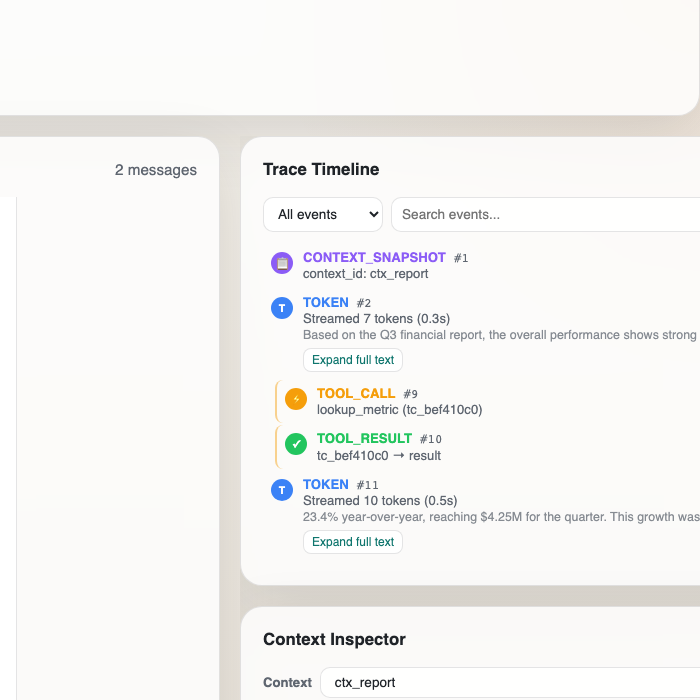
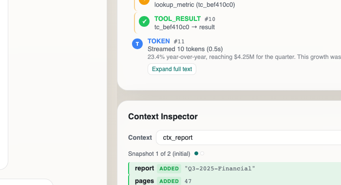

# Agent Console

Real-time **Agent Console** for AI agent conversations over WebSocket — streaming tokens, mid-stream tool calls, live trace timeline, context diff inspector, and chaos-mode survival.

Built with **Next.js 15**, **React 19**, and a custom protocol client (no Vercel AI SDK).

> Originally completed for the [Alchemyst June 2026 Full Stack AI Engineer](https://github.com/Alchemyst-ai/hiring/tree/main/June-2026_FullStackAI) assignment.

## Repository

| | |
|---|---|
| **Project repo (this)** | https://github.com/mangeshraut712/agent-console |
| **Chaos demo video** | [docs/chaos-mode-recording.mp4](docs/chaos-mode-recording.mp4) |

## Features

- Incremental token streaming with RAF-coalesced UI updates
- Tool call cards with `TOOL_ACK`, resume without duplication
- Seq-based reorder buffer (out-of-order + duplicate handling)
- Trace timeline with token batching, filters, bidirectional highlight
- Context inspector with JSON diff + history scrubber (500KB+ payloads)
- Reconnection with exponential backoff + `RESUME(last_seq)`
- 34 unit tests + protocol verification script

## Quick Start

### 1. Agent server (Docker)

```bash
cd agent-server
docker build -t agent-server .
docker run -p 4747:4747 agent-server                # normal mode
docker run -p 4747:4747 agent-server --mode chaos    # chaos mode
```

### 2. Frontend

```bash
npm install
npm run dev          # Turbopack dev server
# or production:
npm run build && npm run start
npm test
npm run typecheck
npm run verify:server
```

Open [http://localhost:3000](http://localhost:3000), click **Connect**, send a message.

**Single WebSocket client only** — before Connect:

```bash
bash scripts/ensure-clean-ws.sh
curl -s http://localhost:4747/reset
```

## Architectural Approach

The Agent Console is a **state-machine-driven WebSocket client**. Real-time agent rendering is a distributed systems problem: out-of-order delivery, mid-stream tool interruptions, connection drops with state recovery, and chaotic failure modes — while keeping smooth incremental rendering.

Three layers:

1. **Protocol** (`src/lib/`) — `WebSocketManager`, `ReorderBuffer`, `diff`, `flushScheduler`, `useAgentConsole`
2. **UI** (`src/components/`) — `ChatPanel`, `ToolCard`, `TraceTimeline`, `ContextInspector`, `ConnectionIndicator`
3. **Layout** — `AgentConsole` wires hook → UI

See [DECISIONS.md](./DECISIONS.md) for seq ordering, layout-shift prevention, reconnection, and scale questions.

## State Machine

```
┌─────────────┐     connect()     ┌──────────────┐
│ Disconnected │ ───────────────→ │  Connecting   │
└─────────────┘                   └──────┬───────┘
      ↑                                  │ ws.onopen
      │                                  ↓
      │                           ┌──────────────┐
      │       ws.close            │  Connected   │
      ├──────────────────────────←│              │
      │                           └──────┬───────┘
      │                                  │
      │     ┌────────────────────────────┼────────────────────┐
      │     ▼                            ▼                    ▼
      │  Streaming (TOKEN)         Tool Call Pending    Heartbeat (PING→PONG)
      │                                  │
      └────────────────────────── Reconnecting → RESUME(last_seq) → Resuming → Connected
```

## Screenshots






## Chaos Mode Demo

[docs/chaos-mode-recording.mp4](docs/chaos-mode-recording.mp4) — connection drops, out-of-order delivery, rapid tool calls, oversized context, corrupt heartbeat.

## Stack

| | |
|---|---|
| Next.js | 15.3.8 |
| React | 19.1 |
| TypeScript | 5.8.3 |
| Vitest | 3.2.4 |

## License

MIT — see assignment context; agent-server is provided by Alchemyst for the exercise.
