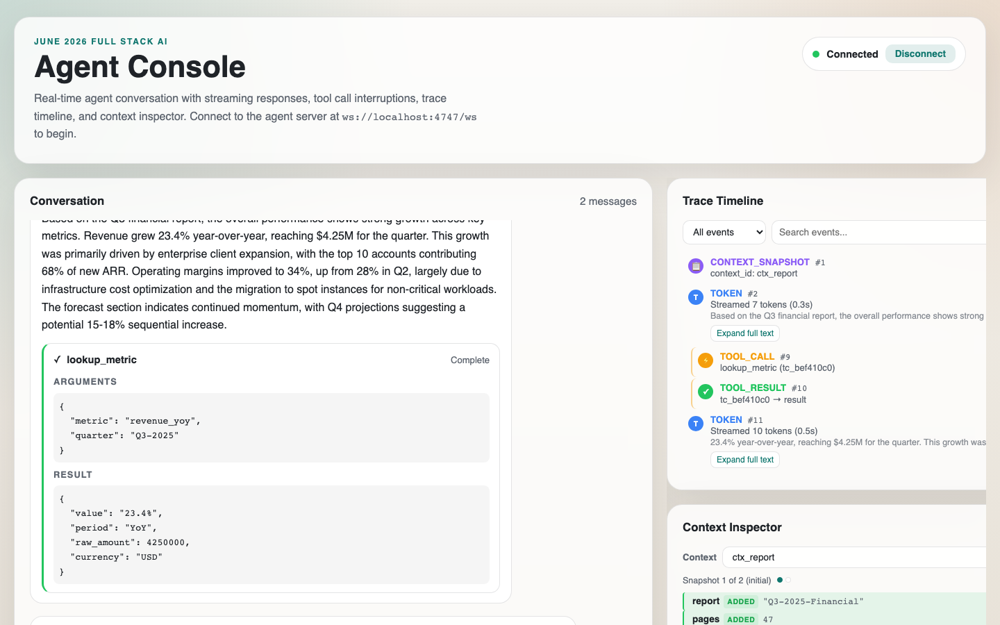

# Agent Console

[](https://github.com/mangeshraut712/agent-console/actions/workflows/ci.yml)

Real-time **Agent Console** for AI conversations over WebSocket — streaming tokens, mid-stream tool calls, live trace timeline, context diff inspector, and chaos-mode survival.

**Stack:** Next.js 15 · React 19 · TypeScript · custom WebSocket protocol (no Vercel AI SDK)

## Demo

| | |
|---|---|
| **Live repo** | https://github.com/mangeshraut712/agent-console |
| **Chaos survival video** | [docs/chaos-mode-recording.mp4](docs/chaos-mode-recording.mp4) |



## Features

- Incremental token streaming with RAF-coalesced UI updates (~60 flushes/sec max)
- Tool call cards with `TOOL_ACK`, stream resume without duplication
- Seq-based reorder buffer (out-of-order + duplicate handling)
- Trace timeline — token batching, filters, bidirectional chat ↔ trace highlight
- Context inspector — JSON diff, history scrubber, 500KB+ shallow diff mode
- Reconnection — exponential backoff + `RESUME(last_seq)` replay
- 34 unit tests + `npm run verify:server` protocol checker

## Quick Start

### Prerequisites

- Node.js 20+
- Docker (for agent-server)

### 1. Start agent-server

```bash
cd agent-server
docker build -t agent-server .
docker run -p 4747:4747 agent-server              # normal
docker run -p 4747:4747 agent-server --mode chaos # chaos mode
```

### 2. Start frontend

```bash
npm install
npm run dev
```

Open http://localhost:3000 → **Connect** → send a message.

> The server accepts **one** WebSocket client. Before Connect:
> ```bash
> bash scripts/ensure-clean-ws.sh && curl -s http://localhost:4747/reset
> ```

### Production

```bash
npm run build && npm run start
```

### Verify

```bash
npm test
npm run typecheck
npm run verify:server   # requires agent-server on :4747
```

## Architecture

```
src/lib/          Protocol layer (WebSocketManager, ReorderBuffer, useAgentConsole)
src/components/   UI (ChatPanel, TraceTimeline, ContextInspector, ToolCard)
agent-server/     Mock AI backend (provided — do not modify for assignment compliance)
```

Connection state machine: `disconnected → connecting → connected ↔ reconnecting → resuming → connected`

See [DECISIONS.md](./DECISIONS.md) for seq ordering, layout-shift prevention, reconnection, and scale tradeoffs.

## Project structure

```
agent-console/
├── src/
│   ├── app/              Next.js App Router
│   ├── components/       React UI
│   └── lib/              WebSocket client + state machine
├── agent-server/         Docker mock backend
├── docs/                 Screenshots + chaos recording
├── scripts/              verify, capture, WS cleanup
└── DECISIONS.md          Design document
```

## Scripts

| Command | Description |
|---|---|
| `npm run dev` | Dev server (Turbopack) |
| `npm run build` | Production build |
| `npm test` | Vitest unit tests |
| `npm run verify:server` | Protocol compliance check |
| `npm run verify:chaos` | Chaos-mode protocol check |
| `npm run capture:screenshots` | Regenerate README screenshots |

## Background

Built for the [Alchemyst June 2026 Full Stack AI Engineer assignment](https://github.com/Alchemyst-ai/hiring/tree/main/June-2026_FullStackAI).

## License

MIT — see [LICENSE](./LICENSE). The bundled `agent-server` is Alchemyst's assignment fixture.
